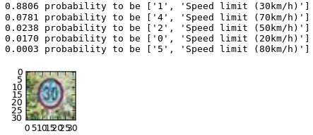

# Trafic Sign Classification

Project for the Self-Driving Car Engineer Nanodegree Program

---

## Overview

In this project, I used deep neural networks and convolutional neural networks to classify traffic signs. I trained a model so it can decode traffic signs from natural images by using the [German Traffic Sign Dataset](http://benchmark.ini.rub.de/?section=gtsrb&subsection=dataset). After the model is trained, I tested my model program on new images of traffic signs I found on the web. An example of a tested image is shown below.

## Dependencies

This project requires **Python 3.5** and the following Python libraries installed:

- [Jupyter](http://jupyter.org/)
- [NumPy](http://www.numpy.org/)
- [SciPy](https://www.scipy.org/)
- [scikit-learn](http://scikit-learn.org/)
- [TensorFlow](http://tensorflow.org)
- [Matplotlib](http://matplotlib.org/)

Run this command at the terminal prompt to install [OpenCV](http://opencv.org/). Useful for image processing:

- `conda install -c https://conda.anaconda.org/menpo opencv3`

## Opening the code

1. If you want to train the classifier again, [download the dataset](https://d17h27t6h515a5.cloudfront.net/topher/2016/November/581faac4_traffic-signs-data/traffic-signs-data.zip). This is a pickled dataset in which Udacity team already resized the images to 32x32.

3. Follow the instructions in the `Traffic_Signs_Recognition.ipynb` notebook.

